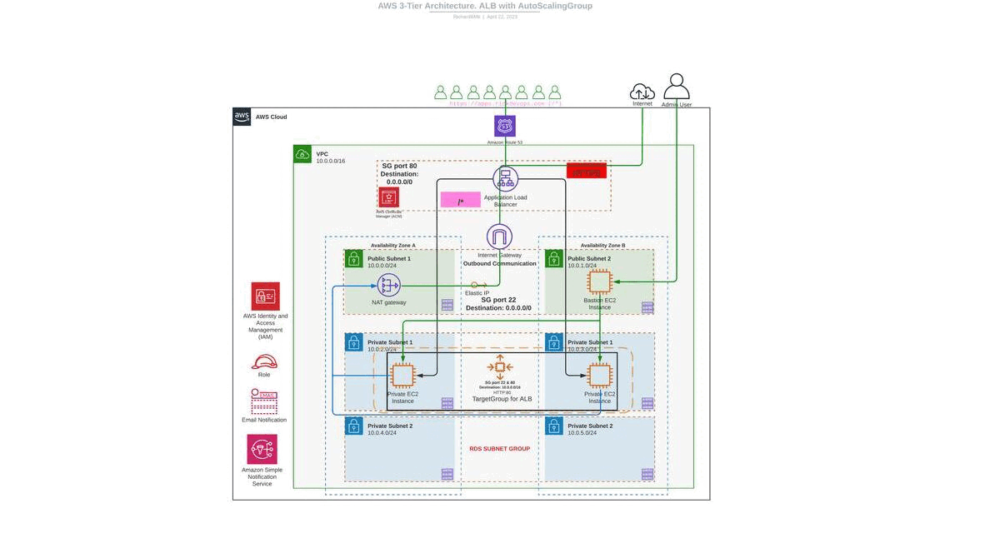

# AWS 3 Tier Architecture Solution

  

## Description

As part of my project portfolio, I have designed and implemented an AWS architecture for a three-tier application using a variety of AWS services, including Amazon Elastic Compute Cloud (EC2), Amazon Relational Database Service (RDS), Amazon Virtual Private Cloud (VPC), Application Load Balancer (ALB), Classic Load Balancer (CLB), Network Load Balancer (NLB), Autoscaling, Amazon Route53, AWS Certificate Manager (ACM), Amazon CloudWatch, Amazon Simple Notification Service (SNS), AWS CodePipeline, AWS CodeBuild, Amazon Simple Storage Service (S3), and more.

The architecture utilizes EC2 for scalable compute resources, RDS for managed database services, and VPC for networking isolation and security. The load balancing is managed by ALB, CLB, and NLB, which distribute traffic among the EC2 instances based on the application requirements. Autoscaling is utilized to automatically adjust the EC2 instances in response to changes in the demand for the application.

Route53 provides DNS management and routing, while ACM is utilized for SSL/TLS certificate management, ensuring secure communication between the application and the end-users. CloudWatch provides comprehensive monitoring and logging services, enabling proactive management of the application.

SNS is utilized for notifications and alerts, providing timely information to the stakeholders in the event of any issues. For continuous integration and continuous deployment (CI/CD), AWS CodePipeline and AWS CodeBuild are utilized. CodePipeline provides a fully managed CI/CD service, while CodeBuild is used for building and testing the application.

Finally, S3 is utilized for storage of static files and artifacts, providing a cost-effective and scalable storage solution for the application.

Overall, this AWS architecture provides a highly available, scalable, and secure environment for the three-tier application.
