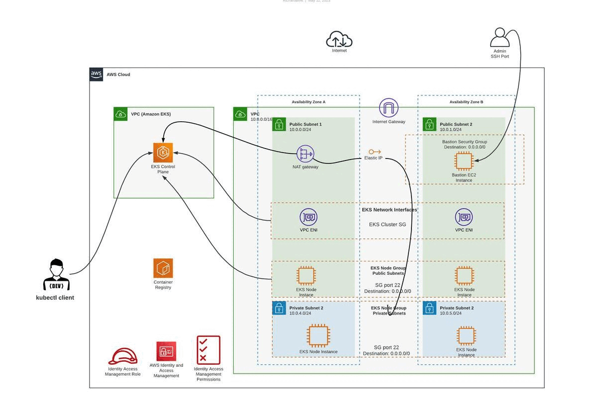

# AWS 3 Tier Architecture Solution

  

## Description

As a cloud architect with expertise in Kubernetes clusters and AWS services, I have designed multiple AWS architecture diagrams that showcase different solutions using Amazon EKS. These diagrams demonstrate how different AWS services like Route 53, AWS IAM, AWS ACM, AWS ALB, and more can be leveraged to build a scalable, highly available, and secure Kubernetes infrastructure.

In addition to the architectural diagrams, I have also included explanations of fundamental concepts related to AWS EKS. These include:

1.**AWS EKS IAM Roles for Service Accounts (IRSA):** This feature allows assigning specific IAM roles to Kubernetes service accounts, enabling fine-grained access control to AWS services.

2. **AWS EKS Networking:** Understanding the networking concepts in EKS is crucial to building a secure and reliable infrastructure. My diagrams showcase different VPC and subnet configurations to ensure optimal networking for your Kubernetes clusters.

3. **EKS Managed node groups vs EKS Fargate Profiles:** This comparison explains the pros and cons of using managed node groups versus Fargate profiles for deploying Kubernetes pods.

4. **Deploying microservice on AWS EKS Cluster:** My diagrams highlight how microservices can be deployed in an EKS cluster using Kubernetes deployment and service resources.

5. **AWS Load Balancer Controller:** I have included diagrams that demonstrate how to use the AWS Load Balancer Controller to manage application traffic in an EKS cluster.

6. **AWS EKS External DNS Concept:** The external DNS concept describes how to set up DNS resolution for Kubernetes services in EKS.

7. **CI/CD Pipeline in combination with AWS EKS:** The diagrams showcase how to set up a continuous integration and deployment (CI/CD) pipeline in combination with EKS to automate the software delivery process.

8. **EKS Authentication and Authorization:** I have included diagrams to explain the authentication and authorization methods available in EKS and how they can be used to secure your Kubernetes clusters.

Overall, my portfolio showcases how I have utilized AWS services to build robust Kubernetes infrastructure while keeping the principles of security, scalability, and availability in mind.

### 1. AWS EKS Networking Architecture Structure

  

### 2. AWS EKS Workload & RDS Database

  

### 3. AWS EKS wit ALB, R53, Ingress & External DNS

  

### 4. AWS EKS Mixed deployment (Fargate Profiles)

  

### 5. Microservice Deployment on AWS EKS Cluster

  

### 6. ALB Controller integration to AWS EKS

  

### 7. ALB INGRESS - CONTEXT PATH BASED ROUTING

  

### 8. AWS EKS CLUSTER - EXTERNAL DNS interagrion

  

### 9. CI/CD Pipeline with AWS EKS Cluster

  

### 10. AWS EKS - IRSA WORKFLOW

  

### 11. AWS EKS Cluster - Authentication & Authorization

  

