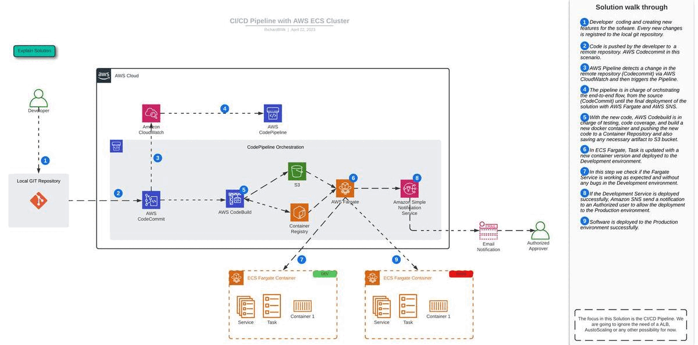

# AWS ECS Fargate Architecture Solution

  

## Description

As part of my portfolio, I have designed and implemented an AWS architecture for a microservice application using a variety of AWS services, including Elastic Container Registry (ECR), AWS App Mesh, Application Load Balancer (ALB), AWS CodePipeline, AWS CodeBuild, AWS CodeCommit, and AWS CloudMap.

The architecture leverages AWS ECR for container image management, allowing for secure storage, management, and deployment of Docker container images. AWS App Mesh is utilized for service mesh management, providing a centralized platform for monitoring, tracing, and load balancing microservices. The ALB acts as the front-facing load balancer, distributing traffic to the microservices running in the backend.

For continuous integration and continuous deployment (CI/CD) of the microservices, AWS CodePipeline, AWS CodeBuild, and AWS CodeCommit are utilized. CodePipeline provides a fully managed CI/CD service, while CodeBuild is used for building and testing Docker container images. CodeCommit is used as the source control repository for the application code.

Finally, AWS CloudMap is utilized for service discovery, providing an easy way to discover and connect to services within the application.

Overall, this AWS architecture provides a scalable, highly available, and secure environment for the microservice application.

### 1. CI/CD Pipeline with AWS ECS Cluster

  

### 2. Microservice deployment on AWS ECS Fargate

  

### 3. Microservice deployment on AWS ECS Fargate With Service Discovery

  

### 4. Microservice deployment with AWS AppMesh on AWS ECS

  

### 5. Microservice deployment with Canary Deployments with AppMesh on AWS ECS

  

